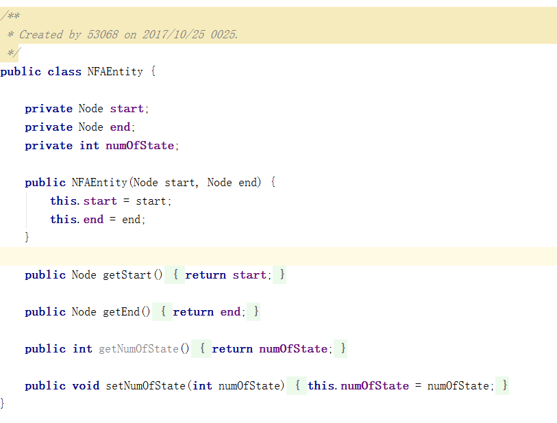

#词法分析器实验报告

##1.实验目的
模仿Lex工具，自己编写一个词法分析器生成工具，更好地理解编译原理

##2.内容描述
此工具是用Java编写的。程序会要求输入一个.l文件，读取其中的内容，生成一个词法分析器。用户可以在.l文件中自定义自己的词法规则，其中的规则参考lex工具的语法，生成的词法分析器语言是Java。该程序会在一定程度上识别.l文件的语法正确性。不支持注释。

##3.思路方法
1. 把.l文件中的各部分抽离出来
2. 将.l读取出来的正则表达式进行规范化，并转换成后缀表达式
3. 对每一个RE转化成NFA再到DFA
4. 合并所有DFA，采取**合并**不**重复**的方法
5. 结合用户自定义规则，生成最终的词法分析器

##4.假设
假设输入的.l文件语法基本正确，没有注释。

##5.相关FA描述
* NFA: 采用图的结构，每个结构体标有起点和终点，其中每个结点有指向下一结点的数组
* DFA: 采用二维数组驱动，竖轴表示状态号，横轴表示边名，其值等于ASCII码的值

##6.重要数据结构
* NFA结点: 
	
* NFA结构体:
	
* DFA结构体:
	

###对于生成后的词法分析器(lexer文件夹): 
* state: 合并DFA的状态转换表
* Lexer.java: 词法分析器的运行主文件，里面包含了用户规则，其中有**text**变量，是每次匹配成功的字符串，可在.l文件中使用，
* Analyzer.java: 词法分析器的分析器，对字符流进行匹配

##7.核心算法
* RE => NFA: 使用Thompson算法，具体在REToNFA.convertToNFA()
* NFA => DFA: 使用e-edge闭包算法,具体在NFAToDFA.eClosureTable()
* DFA合并: 使用**合并**不**重复**算法，类似于NFA=>DFA过程
	

##8.运行截图
* 基于*base-lex.l*生成词法分析器
	
* 使用生成的词法分析器对*test.txt*文件进行分析
	

##9.问题与解决
在整个实验过程中，遇到的最大问题是:

1. 如何将.l文件中的正则表达式转换为简单正则表达式。
	* 对高级符号进行相应的简单符号等价转换
2. 如何将所有RE合并，且能分析出新DFA的终态原本属于哪一条RE的终态。
	* 通过阅读相关论文，再自己研究得出了一种方法。具体在[核心算法]()中有描述。

##10.感受与总结
经过自己思考、查看相关资料，进一步加深对编译原理以及词法分析器的理解。
